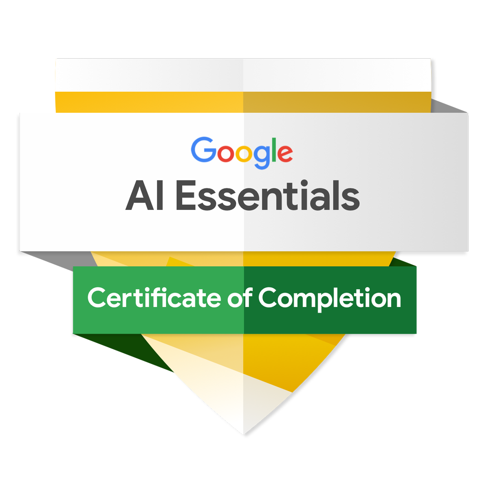

# 👋 Olá, eu sou o Otávio de Pádua

### 🎓 Estudante de Engenharia de Software &nbsp;·&nbsp; 💻 Backend & Mobile &nbsp;·&nbsp; 🤖 Entusiasta de IA

  
  
  

Sou estudante de **Engenharia de Software** na FANS (Faculdade de Nova Serrana), apaixonado por tecnologia e por resolver problemas reais com código. Atualmente desenvolvo com foco em **backend (Java, Node.js)** e **mobile (Ionic/Angular, React Native)**, e venho me aprofundando em **Inteligência Artificial** — de IA generativa (Gemini, LLMs) a modelos rodando localmente.

Além da tecnologia, tenho experiência com empreendedorismo e gestão de processos no setor de produtos em couro legítimo, o que me deu uma visão prática sobre negócios, automação e soluções para problemas reais.

---

## 📜 Certificados de IA

| Certificado | Emissor | Ano | Comprovante |
| --- | --- | :---: | --- |
| **Google AI Essentials** | Google · Coursera | 2026 | [🏅 Badge](./certificados/google-ai-essentials.png) |
| **What Is Generative AI?** | LinkedIn Learning | 2026 | [🔗 Verificar](https://www.linkedin.com/learning/certificates/109f997ae1e60d6efed85d25fb4d8417d4566947bedf060bef2946e915bc2160) · [📄 PDF](./certificados/linkedin-what-is-generative-ai.pdf) |

 

---

## 🤖 Projetos de IA

| Projeto | Descrição | Tecnologias |
| --- | --- | --- |
| [**Passos IA**](https://github.com/GODsGhst/passos-iav2) | App Android contador de passos com **análise biomecânica por IA**: modelo local que roda offline + análise refinada pelo **Google Gemini** quando online, com fallback automático (offline-first). Corrige contagem, estima passada, calcula calorias e detecta fraude | `Ionic` `Angular` `Capacitor` `TypeScript` `Gemini` |
| **Yuki AI** 🚧 | Companheira de chat anime **local-first** (desktop + PWA): LLM rodando localmente via Ollama, 14 personalidades, memória, voz e visão. Em desenvolvimento — em breve no GitHub | `Python` `Ollama` `LLM local` |

## 🚀 Projeto em destaque

| Projeto | Descrição | Tecnologias |
| --- | --- | --- |
| [**Pechincha**](https://github.com/GODsGhst/pechincha) | Comparador de preços por **cupons fiscais (NFC-e)**: lê o QR Code do cupom, extrai os itens e monta um histórico de preços por produto e estabelecimento para descobrir onde está mais barato | `Node.js` `Express` `MongoDB` `Expo/React Native` `React` |

## 🎓 Projetos de faculdade

| Projeto | Descrição | Tecnologias |
| --- | --- | --- |
| [**Conversor de Moedas**](https://github.com/GODsGhst/Conversor-de-Moedas-Simples) | Conversor de moedas simples com backend Express | `JavaScript` `Express` |
| [**CalculadoraGUI**](https://github.com/GODsGhst/CalculadoraGUI) | Calculadora com interface gráfica em Java | `Java` `Swing` |
| [**InterfaceFelipe**](https://github.com/GODsGhst/InterfaceFelipe) | Interface gráfica desenvolvida para estudos na FANS | `Java` |
| [**poo6**](https://github.com/GODsGhst/poo6) | Exercícios de Programação Orientada a Objetos | `Java` |
| [**ExercicioJava**](https://github.com/GODsGhst/ExercicioJava) | Exercícios de Java da faculdade | `Java` |
| [**first-screen-java**](https://github.com/GODsGhst/first-screen-java) | Primeira tela gráfica em Java | `Java` |
| [**GODsGhst.github.io**](https://github.com/GODsGhst/GODsGhst.github.io) | Página pessoal no GitHub Pages | `HTML` `CSS` |

---

## 🛠️ Tecnologias

**Linguagens**

**Frameworks & Mobile**

**Bancos de Dados**

**IA & Ferramentas**

---

## 📈 Atualmente

- 🎓 Cursando **Engenharia de Software**
- 🤖 Estudando **IA generativa** e integração de LLMs em aplicações reais
- ☕ Desenvolvendo projetos backend em **Java** e **Node.js**
- 📱 Criando apps mobile com **Ionic/Angular** e **React Native**
- 🚀 Construindo portfólio com projetos que resolvem problemas reais

---

## 📊 Estatísticas

  
  

*"Construindo o futuro, um commit de cada vez."* ⚡

